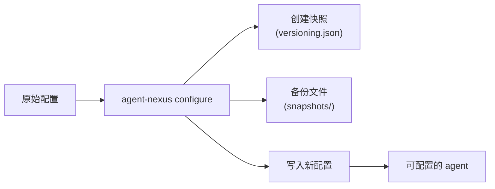
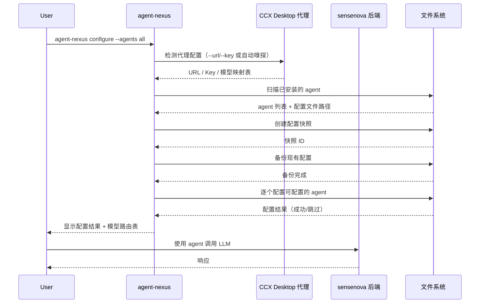
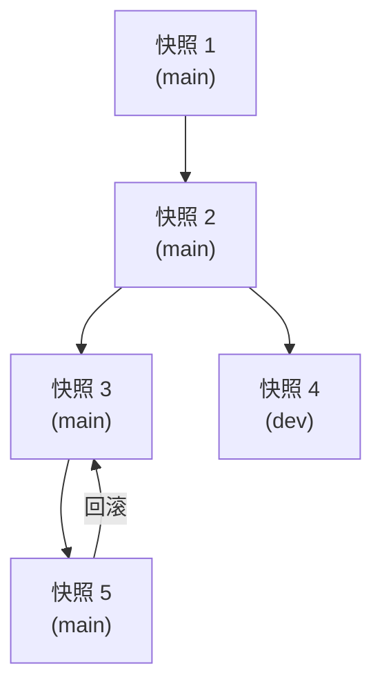

# agent-nexus 用户使用手册

## 核心概念

### 聚合网关（Proxy）
CCX Desktop 作为本地代理服务器运行于 `127.0.0.1:3688`，上游连接 sensenova（`https://token.sensenova.cn`）。所有 agent 通过它统一访问 LLM 后端。

### Agent 配置
每个 AI agent 有自己的配置文件（TOML / JSON / YAML），记录了 API 地址、Key 和模型名。

### 嗅探（Detect）
工具自动读取 CCX Desktop 的 `config.json` 和 `.env` 文件，获取代理 URL、Key 和模型映射表。

### 配置快照（Snapshot）
每次配置生效前，工具会自动创建版本化配置快照（类似 Git commit），存储原始配置和元数据。支持分支、差异对比和回滚，不再依赖单纯的目录备份。



## 快速开始

### 用法 1：一键完整配置

```powershell
.\agent-nexus.exe configure --agents all
```

完整流程：检测代理 → 扫描 agent → 创建快照 → 备份 → 配置所有已安装且可配置的 agent → 显示路由表。

### 用法 2：手动指定代理

```powershell
.\agent-nexus.exe configure --agents all --url http://127.0.0.1:8080/v1 --key sk-your-key
```

直接传入 URL 和 Key，跳过自动嗅探。

### 用法 3：只配置特定 agent

```powershell
.\agent-nexus.exe configure --agents claude,kimi
```

只配置 Claude 和 Kimi，跳过其他 agent。

### 用法 4：查看当前状态

```powershell
.\agent-nexus.exe status
.\agent-nexus.exe route
```

## 完整命令参考

### configure — 备份后自动配置指定的 agent（必选 --agents）

```powershell
.\agent-nexus.exe configure --agents all
.\agent-nexus.exe configure --agents claude,kimi
.\agent-nexus.exe configure --agents all --url http://proxy:9000/v1 --key sk-xxx
```

流程：
1. 检测 CCX Desktop 代理（或用 `--url`/`--key` 指定）
2. 扫描已安装的 AI agent
3. 创建配置快照（自动版本化）
4. 备份现有配置（兼容旧格式）
5. 逐个配置可配置的 agent
6. 显示配置结果和模型路由表

> ⚠️ **`--agents` 为必选参数**，不支持无参调用。使用 `all` 配置所有已安装的 agent，或用逗号分隔指定 agent 名称。

### backup — 备份所有 agent 配置（自动版本化）

```powershell
.\agent-nexus.exe backup
.\agent-nexus.exe backup --branch production
.\agent-nexus.exe backup --message "配置更新前快照"
.\agent-nexus.exe backup --branch pre-release --message "PR v2.0"
```

将所有 agent 配置文件备份到 `~/.codex/backups/snapshots/<时间戳>/`，元数据存储于 `versioning.json`。支持分支和提交信息。

### snapshot — 创建命名快照

```powershell
.\agent-nexus.exe snapshot
.\agent-nexus.exe snapshot --branch dev --message "开发分支配置"
```

创建命名快照，类似 `git commit`。快照包含所有可配置 agent 的当前配置内容和元数据。

### version — 列出所有配置快照

```powershell
.\agent-nexus.exe version
```

显示所有历史配置快照，包括时间戳、分支、提交信息和包含的文件。最新快照标记为 `◀`。

### restore — 恢复到指定快照

```powershell
.\agent-nexus.exe restore --snapshot latest
.\agent-nexus.exe restore --snapshot 2026-07-17_14-30-00
```

从指定的历史快照恢复 agent 配置文件。支持 `latest` 恢复最新快照。

> 先使用 `agent-nexus version` 查看所有可用快照 ID。

### diff — 对比两个快照的差异

```powershell
.\agent-nexus.exe diff --old 2026-07-17_14-30-00 --new 2026-07-17_15-00-00
.\agent-nexus.exe diff --old latest --new 2026-07-17_14-30-00
```

比较两个版本快照之间的配置变更，显示新增、删除和修改的文件。

### branch — 管理配置分支

```powershell
.\agent-nexus.exe branch                        # 列出所有分支
.\agent-nexus.exe branch create production       # 创建生产分支
.\agent-nexus.exe branch switch production       # 切换到生产分支
.\agent-nexus.exe branch show                    # 显示当前分支信息
```

### discover — 扫描已安装的 agent

```powershell
.\agent-nexus.exe discover                     # 摘要表（agent 名称/状态）
.\agent-nexus.exe discover -v                  # 详细表（含模型支持详情）
```

列出所有已扫描到的 AI agent 及其配置文件路径。`-v` 详细模式还会显示各 agent 的默认模型、路由目标和模型来源。

### detect — 检测代理配置

```powershell
.\agent-nexus.exe detect
.\agent-nexus.exe detect --url http://proxy:9000/v1 --key sk-xxx
```

读取 CCX Desktop 配置并输出代理地址、Key 和模型映射表。

### status — 显示各 agent 状态

```powershell
.\agent-nexus.exe status
```

输出每个 agent 的安装状态和配置状态：
- 🔗 已配置代理
- ⚙️ 已安装但未配置代理
- ❌ 未安装

### route — 显示模型路由表

```powershell
.\agent-nexus.exe route
```

显示三层模型路由：各 agent 的写入模型 → 实际后端模型，以及 CCX 自动映射表。

### sniff — 嗅探 LLM 提供商消息格式与模型

```powershell
.\agent-nexus.exe sniff --url https://token.sensenova.cn/v1 --key sk-xxx
.\agent-nexus.exe sniff --url http://127.0.0.1:8080/v1 --key sk-xxx
```

嗅探指定的 LLM provider endpoint，自动检测其支持的消息格式（如 OpenAI 兼容协议等）和可用模型列表。

探测流程：
1. `/v1/models` — 获取可用模型列表
2. `/v1/chat/completions` — 验证 OpenAI 格式兼容性
3. `/v1/messages` — 验证 Anthropic Messages API 兼容性

基础模式输出示例：

```
正在嗅探 LLM endpoint: https://token.sensenova.cn/v1

  Endpoint: https://token.sensenova.cn/v1
  支持格式: OpenAI models API / OpenAI chat completions / Anthropic Messages API

  可用模型 (4):
    - sensenova-6.7-flash-lite
    - deepseek-v4-flash
    - glm-5.2
    - sensenova-u1-fast
```

`-v` / `--verbose` 详细模式还会显示每个模型的完整信息和能力推断：

```
可用模型 (4):
  sensenova-6.7-flash-lite
    context:262144, max_output:65536, input:[text image], output:[text]
    features:[tools json_mode reasoning], quant:fp8
    描述: SenseNova 6.7 Flash-Lite is a lightweight multimodal agent model...
    pricing: map[completion:0 image:0 input_cache_read:0 prompt:0 request:0]
    supported_features: [tools json_mode reasoning]

  deepseek-v4-flash
    context:1048576, max_output:65536, input:[text], output:[text]
    features:[tools json_mode reasoning], quant:fp8
    描述: DeepSeek V4 Flash is a high-performance conversational model...
```

支持显示的模型字段：`context_length`、`max_output_length`、`input_modalities`、`output_modalities`、`supported_features`、`quantization`、`description`、`pricing`、`datacenters`、`businesses` 等。
## 工作流程



## 配置快照与版本化

agent-nexus 使用类似 Git 的配置版本管理系统：



| 命令 | 功能 |
|------|------|
| `snapshot` | 创建命名快照，类似 `git commit` |
| `version` | 列出所有快照（版本历史） |
| `diff --old A --new B` | 对比两个快照的差异 |
| `restore -s <id>` | 恢复到指定快照，支持 `latest` |
| `branch create <name>` | 创建新分支 |
| `branch switch <name>` | 切换到指定分支 |
| `backup` | 兼容旧格式的备份（自动版本化） |

### 快照存储结构

```
~/.codex/backups/
├── versioning.json          # 元数据注册表（快照索引 + 分支信息）
└── snapshots/
    ├── 2026-07-17_14-30-00/  # 快照 1（原始备份文件）
    ├── 2026-07-17_15-00-00/  # 快照 2
    └── ...
```

## 典型使用场景

### 场景 1：首次使用
```powershell
.\agent-nexus.exe configure --agents all
```

### 场景 2：更换代理地址
```powershell
.\agent-nexus.exe configure --agents all --url http://127.0.0.1:9000/v1 --key new-key
```

### 场景 3：只查看状态（不修改）
```powershell
.\agent-nexus.exe status
.\agent-nexus.exe route
```

### 场景 4：只备份（不配置）
```powershell
.\agent-nexus.exe backup
.\agent-nexus.exe snapshot --message "手动备份"
```

### 场景 5：回滚到之前的配置
```powershell
.\agent-nexus.exe version                           # 查看所有快照
.\agent-nexus.exe restore --snapshot latest         # 回滚到最新快照
.\agent-nexus.exe diff --old latest --new 2026-07-17_14-30-00  # 查看差异
```

### 场景 6：管理配置分支
```powershell
.\agent-nexus.exe branch create production
.\agent-nexus.exe snapshot --branch production --message "生产环境配置"
.\agent-nexus.exe branch switch production
.\agent-nexus.exe configure --agents all
```

### 场景 7：嗅探新 LLM 提供商
```powershell
.\agent-nexus.exe sniff --url https://token.sensenova.cn/v1 --key sk-xxx
```

## 彩色输出含义

| 符号 | 含义 |
|------|------|
| ✅ | agent 已安装 |
| 🔗 | agent 已配置代理 |
| ⚙️ | agent 已安装但未配置代理 |
| ❌ | agent 未安装 |
| ⚠ | 无法配置（使用自有 AI 后端） |

## 故障排查

### 配置失败：无法连接到代理
确保 CCX Desktop 正在运行（`127.0.0.1:3688`）。

### 配置失败：API Key 无效
检查 CCX Desktop 的 `.env` 文件中 `PORT=` 和 `API_KEY=` 设置。

### Cursor 配置不生效
Cursor 的字段名取决于版本。如果自动配置无效，请通过 Cursor 设置 UI → OpenAI Compatible 手动填入相同的 base URL 和 key。

### 配置快照找不到
使用 `agent-nexus version` 查看所有可用快照 ID。快照存储于 `~/.codex/backups/`。

### 回滚配置
使用 `agent-nexus restore --snapshot latest` 恢复到最新快照，或使用 `agent-nexus diff` 查看两个快照之间的差异后再选择目标快照。

## 安全注意事项

- API Key 仅写入各 agent 自身的配置文件，不会扩散到其他地方
- 配置文件均为本地文件，不上传网络
- 备份和快照目录仅本地存储，不对外暴露
- `--url` 和 `--key` 全局选项仅用于本次命令，不会写入任何文件
