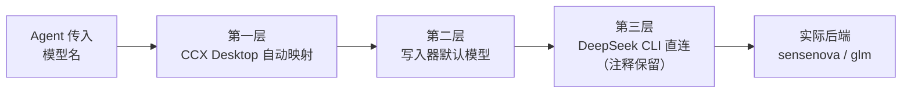
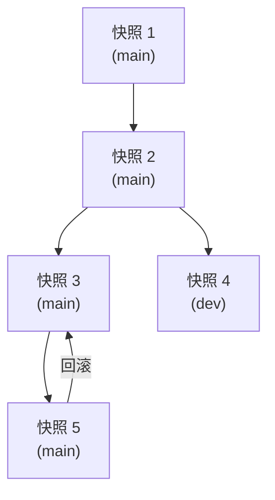
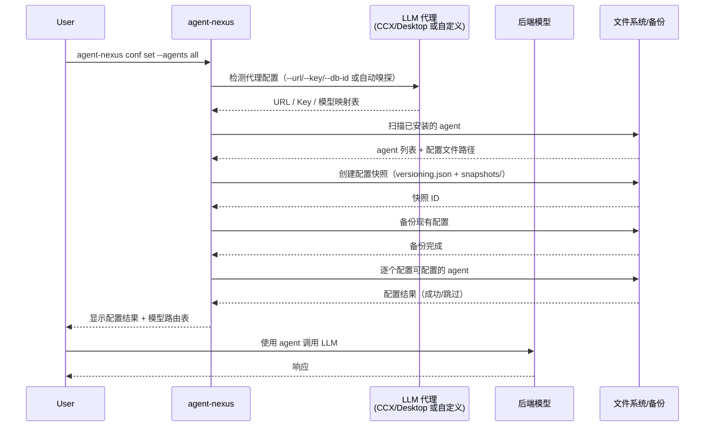

# agent-nexus 用户使用手册

## 功能概览

- **自动发现**：扫描本机已安装的 AI agent（11 个，CLI + IDE）
- **代理检测**：自动读取 CCX Desktop / CC-Switch 配置（URL、Key、模型映射表），也支持任意自定义代理
- **配置写入**：支持 `--url` / `--key` 全局选项，或从代理数据库（SQLite）选择
- **自动备份**：配置生效前自动创建版本化快照（支持分支）
- **统一配置入口**：`agent-nexus conf set --agents all` 完成完整流程
- **模型路由**：三层模型重定向机制，匹配最佳后端
- **版本化管理**：配置快照（snapshot）、分支（branch）、差异对比（diff）、回滚（restore）
- **LLM 嗅探**：自动检测 LLM 提供商的消息格式和可用模型
- **彩色输出**：终端彩色状态显示
- **代理数据库**：嵌入式 SQLite，持久保存已嗅探的代理配置

---

## 支持的 Agent

agent-nexus 围绕 11 个可安装的 agent 运行时构建（`agent list` 返回的权威列表，也是 `agent discover` 和 `agent models` 的扫描范围）。

### 可配置（通过代理转发）— 9 个

| Agent | 类型 | 协议 | 说明 |
|-------|------|------|------|
| codex | CLI | OpenAI Compatible | 任意上游模型 |
| claude | CLI | OpenAI Compatible | 任意上游模型 |
| kimi | CLI | ACP | 需代理路由映射 |
| opencode | CLI | OpenAI Compatible | 任意上游模型 |
| openclaw | CLI | OpenAI Compatible | 任意上游模型 |
| openclaude | CLI | OpenAI Compatible | .env 格式配置 |
| cursor | IDE | OpenAI Compatible | VS Code 派生 |
| hermes | CLI | ACP | 需代理路由映射 |
| kiro | CLI | ACP | 需代理路由映射 |

### 不可配置（无外部模型配置字段）— 2 个

| Agent | 类型 | 说明 |
|-------|------|------|
| grok | CLI | 通过代理路由映射，但无独立模型配置入口 |
| gemini | CLI | Google Gemini CLI，Google auth（OAuth/API key） |

> 以下 agent 可在本机被发现（`agent discover` 仍会识别），但不在可安装运行时列表中，因此不参与 `agent models` 等命令：
> antigravity（Google Gemini, OAuth/API key）、copilot（GitHub 账号权益）、deveco（华为 OpenCode 引擎）、pi（Inflection Pi）、deepseek（OpenAI Compatible, 无内置安装器）、codebuddy（Claude Code 兼容, 无内置安装器）、qoder（ACP）、trae（ACP）、lmstudio（OpenAI Compatible）、clawx（IDE）、qoder-ide / trae-ide / codebuddy-ide / windsurf（IDE 自有 AI 后端）、zed（无内置 AI Agent）。

---

## 安装

### 方式一：使用编译好的可执行文件

下载 `agent-nexus.exe`，在终端运行：

```powershell
agent-nexus --help
```

### 方式二：从源码编译

```powershell
go mod tidy
go build -o agent-nexus.exe
```

---

## 全局选项

`--url` 和 `--key` 是全局选项，可用于所有命令，跳过自动检测直接指定代理地址和密钥。`--home` 用于指定用户主目录（默认自动检测）：

```powershell
agent-nexus conf set --agents all --url http://127.0.0.1:8080/v1 --key sk-xxx
agent-nexus proxy detect --url http://proxy:9000/v1 --key abc
agent-nexus --home /custom/path agent discover
```

---

## 快速开始

```powershell
# 1. 检查并安装运行时依赖
agent-nexus pre check
agent-nexus pre install

# 2. 安装 agent 运行时
agent-nexus agent install codex
agent-nexus agent install claude

# 3. 统一配置所有已安装 agent
agent-nexus conf set --agents all

# 4. 验证配置结果
agent-nexus agent discover
agent-nexus agent discover -v   # 显示模型详情
```

---

## 代理支持

agent-nexus 支持四种代理接入方式：

### CCX Desktop（自动检测）

自动读取 CCX Desktop 的配置文件（`~\AppData\Roaming\ccx-desktop\.config\config.json`）和 `.env` 文件，获取代理地址、Key 和模型映射表。CCX Desktop 需保持运行（默认监听 `127.0.0.1:3688`）。

### CC-Switch（自动检测）

自动读取 CC-Switch 的配置文件（`~\AppData\Roaming\cc-switch\.config\config.json`）和 `.env` 文件，获取代理地址、Key 和模型映射表。CC-Switch 需保持运行。检测顺序：CCX Desktop → CC-Switch → 回退。

### 自定义代理（手动指定）

通过 `--url` + `--key` 指定任意代理地址：

```powershell
agent-nexus conf set --agents all --url http://127.0.0.1:8080/v1 --key sk-your-key
agent-nexus proxy detect --url https://proxy.example.com/v1 --key abc123
agent-nexus proxy route --url http://my-local-proxy:9000/v1 --key mykey
agent-nexus proxy sniff -u https://token.sensenova.cn/v1 -k sk-xxx
```

### 代理数据库

通过 `proxy db add` 嗅探并保存代理配置到嵌入式 SQLite 数据库，供后续 `conf set --db-id` 复用（详见下方 [proxy db 命令](#proxy-db-命令)）。

### 代理类型汇总

| 代理类型 | 说明 |
|---------|------|
| CCX Desktop | 自动检测 CCX Desktop 配置 |
| CC-Switch | 自动检测 CC-Switch 配置 |
| 自定义代理 | 通过 `--url` + `--key` 手动指定 |
| 本地代理 | 通过 `--url` 指定本地运行的代理 |
| 代理数据库 | `proxy db add` 嗅探保存，`conf set --db-id` 复用 |

---

## pre 命令：运行时依赖管理

在安装 agent 运行时之前，检查并安装必需的依赖工具（Node.js/npm、Python/pip、Git）：

```powershell
# 检查所有依赖工具状态
agent-nexus pre check

# 检查单个工具
agent-nexus pre check --tool node
agent-nexus pre check --tool pip
agent-nexus pre check --tool git

# 安装缺失的依赖工具
agent-nexus pre install

# 只安装某个缺失工具
agent-nexus pre install --tool node
```

自动安装根据平台选择包管理器：

| 平台 | 包管理器 | 示例命令 |
|------|----------|----------|
| Windows | winget | `winget install -e --id OpenJS.NodeJS.LTS` |
| Linux (Debian/Ubuntu) | apt | `apt install -y nodejs npm` |
| Linux (RHEL/CentOS/Fedora) | yum/dnf | `yum install -y nodejs npm` |
| macOS | brew | `brew install node` |

自动安装失败时，会打印手动安装提示。

---

## agent 命令：Agent 运行时管理

### agent discover

扫描本机已安装的 AI agent，显示配置状态：

```powershell
agent-nexus agent discover          # 基本列表
agent-nexus agent discover -v       # 显示每个 agent 支持的模型及模型来源
```

### agent list

显示可安装的 agent 运行时列表：

```powershell
agent-nexus agent list
```

### agent install

安装指定的 AI agent 运行时，支持 Windows、Linux、macOS：

```powershell
agent-nexus agent install codex            # 安装单个 agent
agent-nexus agent install --all            # 安装全部 CLI agent
agent-nexus agent install --all --execute  # 直接执行安装命令（默认启用）
agent-nexus agent install codex --force    # 强制安装
```

### agent uninstall

卸载指定的 AI agent 运行时：

```powershell
agent-nexus agent uninstall codex
agent-nexus agent uninstall claude
```

### agent update

更新指定的 AI agent 运行时到最新版本：

```powershell
agent-nexus agent update codex
agent-nexus agent update claude
```

### agent models

显示每个 agent 运行时本身支持的模型（LLM）信息：

```powershell
agent-nexus agent models                    # 显示所有 agent
agent-nexus agent models --name codex       # 查询特定 agent
agent-nexus agent models claude             # 同上（位置参数）
```

输出内容：

- Agent 名称与类型（CLI / IDE）
- 协议类型（OpenAI Compatible / ACP / N/A）
- 模型来源：自定义模型 / 需重定向 / 自有模型
- 模型列表：agent 本身可接受的模型名
- 说明：备注信息

---

## 代理命令：proxy

### proxy detect

检测 AI 代理配置（URL、Key、模型映射）：

```powershell
agent-nexus proxy detect
agent-nexus proxy detect --url http://proxy:9000/v1 --key abc
```

### proxy route

显示模型路由表（三层机制，见下方 [模型路由](#模型路由三层机制)）：

```powershell
agent-nexus proxy route
agent-nexus proxy route --url http://proxy:9000/v1 --key abc
```

### proxy sniff

嗅探 LLM 提供商的 endpoint，自动检测其支持的消息格式和可用模型列表：

```powershell
agent-nexus proxy sniff -u https://api.example.com/v1 -k sk-xxx
agent-nexus proxy sniff -u http://127.0.0.1:3688/v1 -k key123 -v
```

### proxy db 命令

`proxy db` 命令用于管理已嗅探的代理配置数据库（嵌入式 SQLite），支持嗅探、保存、查看、检查、删除代理记录。

```powershell
agent-nexus proxy db add  -u <url> -k <key>  嗅探并保存到数据库
agent-nexus proxy db list                        列出已保存的代理配置
agent-nexus proxy db show <id>                   显示代理配置详情
agent-nexus proxy db rm <id>                     删除指定代理配置
agent-nexus proxy db rm --all                    删除全部代理配置
agent-nexus proxy db query [filter]              查询代理配置（按 ID 或 URL 过滤）
agent-nexus proxy db check <id>                  嗅探指定记录是否仍然有效
agent-nexus proxy db check --all                 嗅探所有记录
```

#### `proxy db add`

嗅探指定代理 URL，自动检测消息格式和可用模型列表，保存到 SQLite 数据库：

```powershell
agent-nexus proxy db add -u https://api.example.com/v1 -k sk-xxx
```

#### `proxy db list`

列出数据库中所有已保存的代理配置：

```powershell
agent-nexus proxy db list
```

#### `proxy db show <id>`

显示指定 ID 的代理配置完整详情，包括完整 API Key 和全部模型名称列表：

```powershell
agent-nexus proxy db show 2
```

#### `proxy db rm <id>` / `rm --all`

删除指定 ID 的代理配置记录；`--all` 删除数据库中所有记录并重置 ID 计数器：

```powershell
agent-nexus proxy db rm 2
agent-nexus proxy db rm --all
```

#### `proxy db query [filter]`

按 ID 或 URL 子串过滤查询代理配置：

```powershell
agent-nexus proxy db query 1              # 按 ID 精确查询
agent-nexus proxy db query example.com    # 按 URL 子串模糊查询
agent-nexus proxy db query                # 列出所有记录
```

#### `proxy db check <id>` / `check --all`

嗅探指定 ID 或所有记录是否仍然有效（相当于 `proxy sniff`）。对无效记录交互提示是否删除：

```powershell
agent-nexus proxy db check 2
agent-nexus proxy db check --all
```

---

## conf 命令：配置管理

### conf set（推荐入口）

`agent-nexus conf set` 是统一的配置入口，整合了备份和配置写入，是 `agent configure` 和 `conf auto` 的合并与升级：

```powershell
agent-nexus conf set --agents all                          # 配置所有已安装 agent
agent-nexus conf set --agents codex,claude                 # 只配置部分 agent
agent-nexus conf set --agents all --models "codex=gpt-5.5" # 覆盖模型映射
agent-nexus conf set --agents all --db-id 1                # 从代理数据库按 ID 选择代理
agent-nexus conf set --agents all --db                     # 从代理数据库交互/非交互选择
agent-nexus conf set --agents all --interactive            # 交互式确认模型映射
agent-nexus conf set --agents all --dry-run                # 预览模式，不实际写入
agent-nexus conf set --agents all --branch staging -m "msg"  # 指定快照分支和信息
```

代理来源优先级（从高到低）：

1. `--url` + `--key` — 直接使用，跳过检测和 DB
2. `--db-id <n>` — 从 `proxies.db` 按 ID 查找
3. `--db` — 从 `proxies.db` 交互/非交互选择
4. 自动检测 — `proxy.Detect()`（CCX Desktop / CC-Switch）

备份粒度：

- `--agents all` → 全局备份（global）
- 单个或多个 agent → 逐 agent 备份（per-agent）

### conf backup

创建指定 agent 配置文件的只读快照（推荐替代 `conf bak`）：

```powershell
agent-nexus conf backup                          # 备份所有已安装且可配置的 agent
agent-nexus conf backup --agents codex,claude    # 只备份指定 agent
agent-nexus conf backup --dry-run                # 预览模式，不实际写入
agent-nexus conf backup --branch staging -m "msg"  # 指定分支和提交信息
```

行为：

- 只读快照，不写入任何配置
- 同时写入数据库（`backup_snapshots` + `backup_config_entries`）和文件系统（`~/.codex/backups/snapshots/<id>/`）

### conf history

列出所有历史配置快照（版本历史）：

```powershell
agent-nexus conf history                                          # 显示所有快照
agent-nexus conf history --branch main                            # 只显示主分支
```

### conf diff

比较两个版本快照之间的配置变更，显示新增、删除和修改的文件：

```powershell
agent-nexus conf diff --old 2026-07-17_14-30-00 --new 2026-07-17_15-00-00
agent-nexus conf diff --old latest --new 2026-07-17_14-30-00
```

### conf rollback

从指定的历史快照恢复 agent 配置文件：

```powershell
agent-nexus conf rollback -s 2026-07-17_14-30-00    # 恢复指定快照
agent-nexus conf rollback -s latest                  # 恢复到最新快照
```

### conf branch

管理配置快照的分支，类似 `git branch`：

```powershell
agent-nexus conf branch create production    # 创建生产分支
agent-nexus conf branch switch production    # 切换到生产分支
agent-nexus conf branch list                 # 列出所有分支
agent-nexus conf branch show                 # 显示当前分支信息
agent-nexus conf backup --branch production     # 在指定分支上创建快照
```

### conf upstream-models

查询 AI 代理（如 CCX/Desktop）的上游可用模型列表，用于在配置前确认代理当前实际接入的模型：

```powershell
agent-nexus conf upstream-models
agent-nexus conf upstream-models --url http://127.0.0.1:3688/v1 --key sk-xxx
```

### conf auto（已弃用，兼容）

`conf set` 的别名，仅通过自动检测（`proxy.Detect`）配置代理，不读取 `--db` / `--db-id`。保留以兼容旧用法：

```powershell
agent-nexus conf auto --agents all
agent-nexus conf auto --agents codex --models "codex=gpt-5.5"
agent-nexus conf auto --agents all --dry-run
```

### 已弃用命令

| 旧命令 | 替代命令 |
|--------|---------|
| `agent configure` | `conf set` |
| `conf auto` | `conf set` |
| `conf bak` | `conf backup` |
| `conf show` | `conf backup --message` |

---

## 模型路由（三层机制）


```mermaid
flowchart LR
    A["Agent 传入<br/>模型名"] --> B["第一层<br/>CCX Desktop 自动映射"]
    B --> C["第二层<br/>写入器默认模型"]
    C --> D["第三层<br/>DeepSeek CLI 直连<br/>（注释保留）"]
    D --> E["实际后端<br/>sensenova / glm"]
```

**第一层：CCX/Desktop 自动映射** — Agent 传入模型名（如 `gpt-5.5`），代理自动映射到实际后端模型。

**第二层：写入器默认模型** — agent-nexus 写入各 agent 配置文件时使用的默认模型名。具体映射关系可运行 `agent-nexus proxy route` 查看当前路由表。

**第三层：DeepSeek CLI 备选直连** — 配置中保留直连方案（注释形式）。

### 模型来源说明

可配置 agent 的模型来源分为三类：

- **自定义模型**（OpenAI Compatible）：agent 可直接使用上游网关的任何模型名。
- **需重定向**（ACP）：需代理将上游模型映射为 agent 可识别的名称。
- **自有模型**（N/A）：agent 内置模型目录，不走外部代理。

> 详细模型信息运行 `agent-nexus agent models` 查看。

---

## 配置快照与版本化管理

agent-nexus 引入类似 Git 的配置版本管理系统，支持快照、分支、差异对比和回滚：


```mermaid
graph TD
    S1["快照 1<br/>(main)"] --> S2["快照 2<br/>(main)"]
    S2 --> S3["快照 3<br/>(main)"]
    S2 --> S4["快照 4<br/>(dev)"]
    S3 --> S5["快照 5<br/>(main)"]
    S5 --> |回滚| S3
```

| 命令 | 功能 |
|------|------|
| `conf backup` | 创建只读快照（推荐） |
| `conf history` | 列出所有快照，显示分支、时间、提交信息、文件列表 |
| `conf diff --old A --new B` | 对比两个快照的差异（新增 / 删除 / 修改 / 未变） |
| `conf rollback -s <id>` | 恢复到指定快照，支持 `latest` |
| `conf branch create <name>` | 创建新分支 |
| `conf branch switch <name>` | 切换到指定分支 |
| `conf branch list` | 列出所有分支 |
| `conf branch show` | 显示当前分支信息 |

### 快照存储结构

```
~/.codex/backups/
├── versioning.json          # 元数据注册表（快照索引 + 分支信息）
└── snapshots/
    ├── 2026-07-17_14-30-00/  # 快照 1（原始备份文件）
    ├── 2026-07-17_15-00-00/  # 快照 2
    └── ...
```

---

## 工作流程


```mermaid
sequenceDiagram
    participant User
    participant Tool as agent-nexus
    participant Proxy as LLM 代理<br/>(CCX/Desktop 或自定义)
    participant Backend as 后端模型
    participant FS as 文件系统/备份

    User->>Tool: agent-nexus conf set --agents all
    Tool->>Proxy: 检测代理配置（--url/--key/--db-id 或自动嗅探）
    Proxy-->>Tool: URL / Key / 模型映射表
    Tool->>FS: 扫描已安装的 agent
    FS-->>Tool: agent 列表 + 配置文件路径
    Tool->>FS: 创建配置快照（versioning.json + snapshots/）
    FS-->>Tool: 快照 ID
    Tool->>FS: 备份现有配置
    FS-->>Tool: 备份完成
    Tool->>FS: 逐个配置可配置的 agent
    FS-->>Tool: 配置结果（成功/跳过）
    Tool-->>User: 显示配置结果 + 模型路由表
    User->>Backend: 使用 agent 调用 LLM
    Backend-->>User: 响应
```

---

## 扩展新 Agent

实现 `agent.ConfigWriter` 接口并注册到 `WriterRegistry` 即可：

```go
type myAgentWriter struct{}

func newMyAgentWriter() *myAgentWriter { return &myAgentWriter{} }

func (w *myAgentWriter) Name() string     { return "myagent" }
func (w *myAgentWriter) Category() string { return "cli" }
func (w *myAgentWriter) CanConfigure(p *proxy.Proxy) bool { return true }
func (w *myAgentWriter) Configure(path string, p *proxy.Proxy) error { /* 写入逻辑 */ }
func (w *myAgentWriter) Status(path string) (bool, string) { /* 状态检测 */ }
```

然后在 `agent.go` 的 `NewWriterRegistry()` 中注册：

```go
writers: []ConfigWriter{
    // ... 现有写入器
    newMyAgentWriter(),
},
```

---

## 注意事项

- CCX/Desktop 需保持运行（监听 `127.0.0.1:3688`），或使用 `--url` 指定自定义代理
- Cursor 的字段名取决于版本，不匹配时需通过 Cursor 设置 UI 手动填入
- **推荐**使用 `agent-nexus conf set` 作为统一配置入口
- 配置快照存储于 `~/.codex/backups/`，使用 `agent-nexus conf history` 查看所有快照
- 敏感信息（API Key）仅写入各 agent 自身配置文件，未扩散
- 配置生效前所有原始配置文件均已备份并创建快照，可随时回滚
- **OpenClaude** 配置写入 `~/.openclaude-env` 文件（.env 格式），启动时需指定：`openclaude --provider-env-file ~/.openclaude-env`。也可设置系统环境变量 `CLAUDE_CODE_USE_OPENAI=1`、`OPENAI_API_KEY`、`OPENAI_BASE_URL`、`OPENAI_MODEL` 后直接运行 `openclaude`

---

## 常见问题

### 安装后命令在当前终端无法识别

部分 agent 的安装器会在安装过程中向用户 PATH 注册**新目录**（如 Kimi 安装到 `~\.kimi-code\bin`）。Windows 的 PATH 变更在注册表中立即生效，但**当前已打开的 PowerShell/终端进程不会自动刷新**——PATH 是在进程启动时从注册表读取的，后续注册表变更对该进程不可见。

**表现**：

```powershell
# 安装完 kimi 后，当前终端
kimi
# kimi : 无法将"kimi"项识别为 cmdlet、函数、脚本文件或可运行程序的名称

# 重新打开 PowerShell 后
kimi --version  # ✅ 正常
```

**原因**：Kimi、Hermes、Grok 等通过官方安装脚本安装的 agent，会创建新的安装目录并写入注册表 PATH。而 Codex、Claude、Opencode、Openclaw 等通过 npm 安装的 agent，注册的是 npm 目录下的 `.ps1` 脚本代理——npm 目录在 Node.js 安装时就已在 PATH 中，因此不需要重开终端。

**解决**：安装完成提示 `open a new terminal for it to take effect` 时，**重新打开 PowerShell** 即可。

### Claude Code 提示 "Unable to connect to Anthropic services"

在国内网络环境下，Claude Code 直连 `api.anthropic.com` 不可用，需通过代理配置：

```powershell
# 配置 claude 使用代理
agent-nexus conf set --agents claude

# 或手动指定代理
agent-nexus conf set --agents claude --url http://127.0.0.1:3688/v1 --key sk-xxx
```

### npm 安装后命令无法执行："禁止运行脚本"

npm 在 Windows 上安装的包（如 `@openai/codex`、`@anthropic-ai/claude-code`）会注册 `.ps1` 脚本代理。如果 PowerShell 执行策略为 `Restricted`（默认），则无法运行：

```
codex : 无法加载文件 ...codex.ps1，因为在此系统上禁止运行脚本
PSecurityException: UnauthorizedAccess
```

**解决**：agent-nexus 在 npm 安装成功后会自动执行 `Set-ExecutionPolicy RemoteSigned -Scope CurrentUser`。如果失败，请手动运行：

```powershell
Set-ExecutionPolicy RemoteSigned -Scope CurrentUser
```

`-Scope CurrentUser` 仅影响当前用户，无需管理员权限。

### 新编译的 agent-nexus.exe 无法运行："应用程序控制策略已阻止此文件"

这是企业环境的 **AppLocker / 终端安全策略** 阻止了未签名的 exe 文件运行，与代码无关。

**开发阶段解决方法**：使用 `go run .` 代替 `.\agent-nexus.exe`：

```powershell
# 编译 + 运行
go build -o .\agent-nexus.exe .
go run . pre install --tool=all
go run . agent install codex
go run . agent discover
```

`go run .` 通过 Go 工具链从 `%TEMP%` 运行，通常不在 AppLocker 管控范围内。
