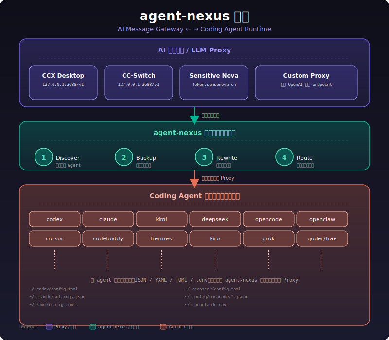

# agent-nexus — AI Agent 配置自动化工具

```
$ ps aux | grep -E 'codex|claude|kimi|deepseek|cursor'
 codex     80382  0.2  codex@localhost   ~/.codex/config.toml      → api.anthropic.com
 claude    80383  0.3  claude@localhost  ~/.claude/settings.json   → api.anthropic.com
 kimi      80384  0.1  kimi@localhost    ~/.kimi/config.toml       → moonshot.cn
 deepseek  80385  0.2  deepseek@local    ~/.deepseek/config.toml   → api.deepseek.com
 cursor    80386  0.4  cursor@localhost  Cursor/User/settings.json → api.openai.com
 opencode  80387  0.1  opencode@local    ~/.config/opencode/*.jsonc → ...
```

每个 agent 都是自己的微服务，配置文件格式各异，API 端点各不相同。
换代理？改 6 个文件。加 agent？再改一个。忘了备份？原地爆炸。

**agent-nexus 是这台机器上所有 coding agent 的 /etc/hosts。**
一条命令，把所有 agent 的上游端点统一重定向到一个 AI 消息网关。

---

## 架构



- **AI 消息网关**（proxy）：统一上游端点，负责模型路由、计费、限流。你只需要关心"用哪个模型"，不需要关心"调哪个 API"。
- **Agent 运行时**（agent）：你日常使用的 coding 工具。各有配置格式，但本质上都是"调一个 LLM endpoint"。
- **agent-nexus**：中间件。扫描本机 agent → 检测代理 → 自动备份 → 重写配置 → 建立模型路由。

---

## 一句话

agent-nexus = **coding agent 配置领域的 `git rebase`**：
一条命令，把散落在各处的 endpoint 和 key 全部重定向到同一个上游。

详细使用方式见 [MANUAL.md](MANUAL.md)。

---

## 项目结构

```
agent-nexus/
├── main.go                          # 入口
├── cmd/
│   └── root.go                      # Cobra CLI 命令定义
└── internal/
    ├── agent/                       # 各 agent 配置写入器（可插拔）
    ├── backup/                      # 备份逻辑
    ├── color/                       # 终端彩色输出
    ├── discover/                    # 自动发现 agent
    ├── model/                       # 模型路由表构建
    ├── proxy/                       # 代理检测（CCX / 自定义）
    ├── sniff/                       # LLM endpoint 嗅探
    └── versioning/                  # 配置版本化（快照/分支/差异）
```

## 扩展新 Agent

实现 `agent.ConfigWriter` 接口并注册到 `WriterRegistry` 即可，参考 [MANUAL.md](MANUAL.md#扩展新-agent)。

## License

MIT
