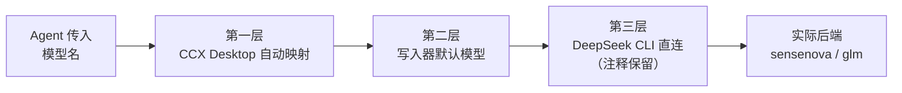
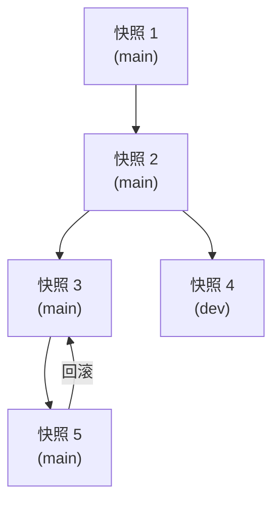
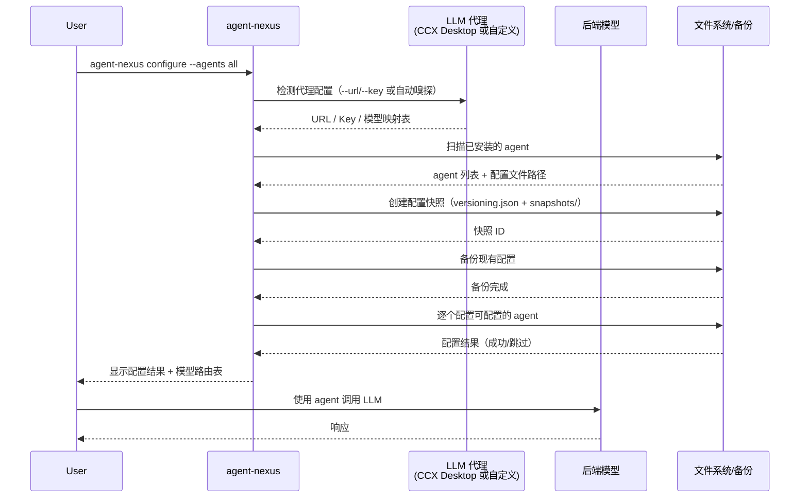

# agent-nexus — AI Agent 配置自动化工具

一键自动发现、备份、配置本机所有 AI coding agent（codex / claude / kimi / deepseek / opencode / cursor 等），将它们统一接入任意 LLM 代理（CCX Desktop 或其他自定义代理）。

## 功能

- **自动发现**：扫描本机已安装的 AI agent（CLI 工具 + IDE）
- **代理检测**：自动读取 CCX Desktop 配置（URL、Key、模型映射表），也支持任意自定义代理
- **配置写入**：支持 `--url` / `--key` 全局选项，也可直接输入 URL 和 Key
- **自动备份**：配置生效前自动创建版本化快照
- **一键配置**：`agent-nexus configure --agents all` 完成完整流程
- **模型路由**：三层模型重定向机制，匹配最佳后端
- **版本化管理**：配置快照（snapshot）、分支（branch）、差异对比（diff）、回滚（restore）
- **LLM 嗅探**：自动检测 LLM 提供商的消息格式和可用模型
- **彩色输出**：终端彩色状态显示

## 支持的 Agent

### 可配置（通过代理转发）

| Agent | 配置文件 | 类型 | 协议 |
|-------|---------|------|------|
| codex | `~/.codex/config.toml` | CLI | OpenAI-compatible |
| claude | `~/.claude/settings.json` | CLI | Anthropic |
| kimi | `~/.kimi/config.toml` | CLI | ACP |
| deepseek | `~/.deepseek/config.toml` | CLI | OpenAI-compatible |
| opencode | `~/.config/opencode/opencode.jsonc` | CLI | AI SDK |
| openclaw | `~/.openclaw/openclaw.json` | CLI | Custom |
| openclaude | `~/.openclaude-env` | CLI | OpenAI-compatible (.env) |
| cursor | `Cursor/User/settings.json` | IDE | OpenAI-compatible |
| codebuddy | `~/.codebuddy/settings.json` | CLI | Anthropic (Claude Code 兼容) |
| hermes | `~/.hermes/config.yaml` | CLI | ACP |
| kiro | `~/.kiro/config.yaml` | CLI | ACP |
| grok | `~/.grok/config.yaml` | CLI | ACP |
| qoder | `~/.qoder/config.yaml` | CLI | ACP |
| trae | `~/.traecli/config.yaml` | CLI | ACP |

### 不可配置（无外部模型配置字段）

| Agent | 类型 | 说明 |
|-------|------|------|
| antigravity | CLI | Google Gemini 服务，无外部模型配置字段 |
| copilot | CLI | 模型由 GitHub 账户权益决定，无外部模型配置字段 |
| deveco | CLI | 基于 OpenCode 引擎，内置华为账号认证与自有模型目录 |
| pi | CLI | Inflection AI 代理，无外部模型配置字段 |
| qoder-ide | IDE | VS Code 派生，自有 AI 后端 |
| trae-ide | IDE | VS Code 派生，自有 AI 后端 |
| codebuddy-ide | IDE | VS Code 派生，自有 AI 后端 |
| windsurf | IDE | VS Code 派生，自有 AI 后端 |
| zed | IDE | 无内置 AI Agent，依赖外部工具 |

## 代理支持

agent-nexus 支持两种代理接入方式：

### CCX Desktop（自动检测）

```powershell
agent-nexus configure --agents all
```

自动读取 CCX Desktop 的配置文件（`~\AppData\Roaming\ccx-desktop\.config\config.json`）和 `.env` 文件，获取代理地址、Key 和模型映射表。CCX Desktop 需保持运行（默认监听 `127.0.0.1:3688`）。

### CC-Switch（自动检测）

```powershell
agent-nexus configure --agents all
```

自动读取 CC-Switch 的配置文件（`~\AppData\Roaming\cc-switch\.config\config.json`）和 `.env` 文件，获取代理地址、Key 和模型映射表。CC-Switch 需保持运行（默认监听 `127.0.0.1:3688`）。检测顺序：CCX Desktop → CC-Switch → 回退。

### 自定义代理（手动指定）

```powershell
agent-nexus configure --agents all --url http://127.0.0.1:8080/v1 --key sk-your-key
agent-nexus detect --url https://proxy.example.com/v1 --key abc123
agent-nexus route --url http://my-local-proxy:9000/v1 --key mykey
agent-nexus sniff -u https://token.sensenova.cn/v1 -k sk-xxx
```

`--url` 和 `--key` 是全局选项，可覆盖自动检测，支持任意代理地址和密钥。`sniff` 命令还可自动检测自定义 LLM endpoint 的消息格式和可用模型列表。

### 代理类型

| 代理类型 | 说明 |
|---------|------|
| CCX Desktop | 自动检测 CCX Desktop 配置（`~\AppData\Roaming\ccx-desktop`） |
| CC-Switch | 自动检测 CC-Switch 配置（`~\AppData\Roaming\cc-switch`） |
| 自定义代理 | 通过 `--url` + `--key` 手动指定任意代理地址 |
| 本地代理 | 通过 `--url` 指定本地运行的代理（如 `http://127.0.0.1:8080/v1`） |

> ⚠️ **每次配置仅支持一个代理**。agent-nexus 不支持同时配置多个代理，所有 agent 共享同一个代理地址。

## 安装

### 方式一：使用编译好的可执行文件

直接下载 `agent-nexus.exe`，在终端运行：

```powershell
.\agent-nexus.exe --help
```

### 方式二：从源码编译

```powershell
go mod tidy
go build -o agent-nexus.exe
```

## 快速开始

```powershell
# 一键扫描 → 检测代理 → 创建快照 → 配置所有已安装的 agent
agent-nexus configure --agents all
```

## 命令参考

```
agent-nexus configure --agents <agents>   备份后自动配置指定的 agent（必选 --agents）
agent-nexus discover [-v]                  扫描已安装的 agent（-v 显示模型详情）
agent-nexus detect                         检测 CCX Desktop 代理配置
agent-nexus status                         显示各 agent 当前配置状态
agent-nexus route                          显示模型路由表
agent-nexus backup [-b <branch>] [-m <msg>] 备份所有配置（创建快照）
agent-nexus snapshot [-b <branch>] [-m <msg>] 创建命名快照
agent-nexus version                        列出所有配置快照
agent-nexus restore -s <id>                恢复到指定快照（支持 "latest"）
agent-nexus diff --old <id> --new <id>     对比两个快照的差异
agent-nexus branch                         管理配置分支（create / switch / list / show）
agent-nexus sniff -u <url> -k <key> [-v]   嗅探 LLM 提供商的消息格式和可用模型
```

### 全局选项

`--url` 和 `--key` 是全局选项，可用于所有命令，跳过自动嗅探直接指定代理地址和密钥：

```powershell
agent-nexus configure --agents all --url http://127.0.0.1:8080/v1 --key sk-xxx
agent-nexus detect --url http://proxy:9000/v1 --key abc
agent-nexus route --url http://proxy:9000/v1 --key abc
agent-nexus sniff -u https://token.sensenova.cn/v1 -k sk-xxx
```

## 模型路由（三层机制）



**第一层：CCX Desktop 自动映射** — Agent 传入模型名（如 `gpt-5.5`），CCX 自动映射到实际后端模型

**第二层：写入器默认模型** — agent-nexus 写入各 agent 配置文件时使用的默认模型名

| Agent | 写入模型 | → 实际后端 | 来源 |
|-------|---------|-----------|------|
| codex | gpt-5.5 | sensenova-6.7-flash-lite | CCX 映射 |
| claude | fable | glm-5.2 | CCX 映射 |
| kimi | gpt-5.5 | sensenova-6.7-flash-lite | CCX 映射 |
| deepseek | sensenova-6.7-flash-lite | sensenova-6.7-flash-lite | 直连 |
| opencode | myccx/glm-5.2 | glm-5.2 | CCX 映射 |
| cursor | sensenova-6.7-flash-lite | sensenova-6.7-flash-lite | 直连 |
| openclaw | sensenova-6.7-flash-lite | sensenova-6.7-flash-lite | CCX 映射 |
| openclaude | sensenova-6.7-flash-lite | sensenova-6.7-flash-lite | CCX 映射 |
| codebuddy | fable | glm-5.2 | CCX 映射 |
| hermes | sensenova-6.7-flash-lite | sensenova-6.7-flash-lite | CCX 映射 |
| kiro | sensenova-6.7-flash-lite | sensenova-6.7-flash-lite | CCX 映射 |
| grok | sensenova-6.7-flash-lite | sensenova-6.7-flash-lite | CCX 映射 |
| qoder | sensenova-6.7-flash-lite | sensenova-6.7-flash-lite | CCX 映射 |
| trae | sensenova-6.7-flash-lite | sensenova-6.7-flash-lite | CCX 映射 |

**第三层：DeepSeek CLI 备选直连** — 配置中保留 sensenova 直连方案（注释形式）

### 模型来源说明

所有可配置 agent 均通过 OpenAI 兼容协议接入，支持自定义模型名。用户可通过 CCX Desktop 的模型重定义（model redefinition）将自定义模型名映射到后端实际模型。

## 配置快照与版本化管理

agent-nexus 引入类似 Git 的配置版本管理系统，支持快照、分支、差异对比和回滚：



| 命令 | 功能 |
|------|------|
| `snapshot` | 创建命名快照，类似 `git commit` |
| `version` | 列出所有快照（版本历史），显示分支、时间、信息、文件列表 |
| `diff --old A --new B` | 对比两个快照的差异（新增 / 删除 / 修改 / 未变） |
| `restore -s <id>` | 恢复到指定快照，支持 `latest` |
| `branch create <name>` | 创建新分支 |
| `branch switch <name>` | 切换到指定分支 |
| `branch list` | 列出所有分支 |
| `branch show` | 显示当前分支信息 |
| `backup` | 兼容旧格式的备份（自动版本化，默认 `main` 分支） |

### 快照存储结构

```
~/.codex/backups/
├── versioning.json          # 元数据注册表（快照索引 + 分支信息）
└── snapshots/
    ├── 2026-07-17_14-30-00/  # 快照 1（原始备份文件）
    ├── 2026-07-17_15-00-00/  # 快照 2
    └── ...
```

## 工作流程



## 项目结构

```
agent-nexus/
├── main.go                          # 入口
├── go.mod / go.sum
├── AGENTS.md                        # Multica 运行时配置（自动生成，勿编辑）
├── README.md                        # 本文档
├── MANUAL.md                        # 用户使用手册
├── cmd/
│   └── root.go                      # Cobra CLI 命令定义（全部子命令）
└── internal/
    ├── agent/                       # 各 agent 配置写入器（可插拔）
    │   ├── agent.go                 # ConfigWriter 接口 + WriterRegistry 注册表
    │   ├── agent_test.go
    │   ├── codex.go                 # Codex (Anthropic)
    │   ├── claude.go                # Claude Code (Anthropic)
    │   ├── kimi.go                  # Kimi (月之暗面)
    │   ├── deepseek.go              # DeepSeek CLI
    │   ├── opencode.go              # OpenCode
    │   ├── openclaw.go              # OpenClaw
      ├── openclaude.go          # OpenClaude
    │   ├── cursor.go                # Cursor IDE
    │   ├── codebuddy.go             # CodeBuddy CLI (腾讯)
    │   ├── hermes.go                # Hermes (Nous Research)
    │   ├── kiro.go                  # Kiro CLI (Amazon)
    │   ├── grok.go                  # Grok (xAI)
    │   ├── qoder_cli.go             # Qoder CLI (阿里)
    │   └── trae_cli.go              # Trae CLI (字节跳动)
    ├── backup/
    │   ├── backup.go                # 备份逻辑（兼容旧格式）
    │   └── backup_test.go
    ├── color/
    │   ├── color.go                 # 终端彩色输出
    │   └── color_test.go
    ├── discover/
    │   ├── discover.go              # 自动发现 agent
    │   └── discover_test.go
    ├── model/
    │   ├── model.go                 # 模型路由表构建
    │   └── model_test.go
    ├── proxy/
    │   ├── proxy.go                 # 代理检测（CCX Desktop / 自定义）
    │   └── proxy_test.go
    ├── sniff/
    │   └── sniff.go                 # LLM endpoint 嗅探（消息格式 + 模型列表）
    └── versioning/
        ├── versioning.go            # 配置版本化（快照/分支/差异）
        └── versioning_test.go
```

## 扩展新 Agent

实现 `agent.ConfigWriter` 接口并注册到 `WriterRegistry` 即可：

```go
type myAgentWriter struct{}

func newMyAgentWriter() *myAgentWriter { return &myAgentWriter{} }

func (w *myAgentWriter) Name() string     { return "myagent" }
func (w *myAgentWriter) Category() string { return "cli" }
func (w *myAgentWriter) CanConfigure(p *proxy.Proxy) bool { return true }
func (w *myAgentWriter) Configure(path string, p *proxy.Proxy) error { /* 写入逻辑 */ }
func (w *myAgentWriter) Status(path string) (bool, string) { /* 状态检测 */ }
```

然后在 `agent.go` 的 `NewWriterRegistry()` 中注册：

```go
writers: []ConfigWriter{
    // ... 现有写入器
    newMyAgentWriter(),
},
```

## 注意事项

- CCX Desktop 需保持运行（监听 `127.0.0.1:3688`），或使用 `--url` 指定自定义代理
- Cursor 的字段名取决于版本，不匹配时需通过 Cursor 设置 UI 手动填入
- `configure` 命令 **必须** 指定 `--agents` 参数（`all` 或逗号分隔的 agent 名称）
- **每次配置仅支持一个代理**，所有 agent 共享同一个代理地址
- 配置快照存储于 `~/.codex/backups/`，使用 `agent-nexus version` 查看所有快照
- 敏感信息（API Key）仅写入各 agent 自身配置文件，未扩散
- 配置生效前所有原始配置文件均已备份并创建快照，可随时回滚
- **OpenClaude** 配置写入 `~/.openclaude-env` 文件（.env 格式），启动时需指定：`openclaude --provider-env-file ~/.openclaude-env`。也可设置系统环境变量 `CLAUDE_CODE_USE_OPENAI=1`、`OPENAI_API_KEY`、`OPENAI_BASE_URL`、`OPENAI_MODEL` 后直接运行 `openclaude`

## License

MIT
