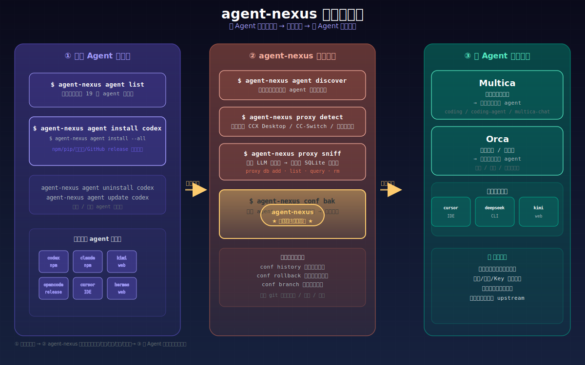

# agent-nexus — AI Agent 配置自动化工具

```powershell
$ ps aux | grep -E 'codex|claude|kimi|deepseek|cursor'
 codex     80382  0.2  codex@localhost   ~/.codex/config.toml      → api.anthropic.com
 claude    80383  0.3  claude@localhost  ~/.claude/settings.json   → api.anthropic.com
 kimi      80384  0.1  kimi@localhost    ~/.kimi/config.toml       → moonshot.cn
 deepseek  80385  0.2  deepseek@local    ~/.deepseek/config.toml   → api.deepseek.com
 cursor    80386  0.4  cursor@localhost  Cursor/User/settings.json → api.openai.com
 opencode  80387  0.1  opencode@local    ~/.config/opencode/*.jsonc → ...
```

每个 agent 都是自己的微服务，配置文件格式各异，API 端点各不相同。换代理？改 6 个文件。加 agent？再改一个。忘了备份？原地爆炸。

**agent-nexus 是这台机器上所有 coding agent 的 `/etc/hosts`。一条命令，把所有 agent 的上游端点统一重定向到一个 AI 消息网关。**

---

## 架构


- **AI 消息网关**（proxy）：统一上游端点，负责模型路由、计费、限流。你只需要关心"用哪个模型"，不需要关心"调哪个 API"。
- **Agent 运行时**（agent）：你日常使用的 coding 工具。各有配置格式，但本质上都是"调一个 LLM endpoint"。
- **agent-nexus**：中间件。扫描本机 agent → 检测代理 → 自动备份 → 重写配置 → 建立模型路由。

---

## 一句话

agent-nexus = **coding agent 配置领域的 `git rebase`**：一条命令，把散落在各处的 endpoint 和 key 全部重定向到同一个上游。

---

## 工作流：从安装到多 Agent 协作



一条完整的自动化链路：

| 阶段 | 动作 | 命令 |
|------|------|------|
| **① 安装 Agent 运行时** | 一键安装 codex/claude/kimi 等 19 个 agent | `agent-nexus agent list/install/uninstall/update` |
| **② agent-nexus 自动配置** | 扫描 → 检测代理 → 备份 → 配置 → 模型路由 | `agent-nexus conf bak`（一键完成） |
| **③ 多 Agent 协作平台** | Multica、Orca、cursor 等平台复用已配置 agent | 无需额外配置，直接使用 |

**agent-nexus 的位置**：中间件 / 配置中枢。所有 agent 运行时的安装和配置都通过它完成，所有下游协作平台只需调用已配置好的 agent 即可——无需每个平台各自配置代理、Key、模型映射。

> 详细用法见 [MANUAL.md](MANUAL.md)。

---

## 安装 Agent 运行时

agent-nexus 自带 agent 运行时安装器，支持 npm、pip、官方下载页、GitHub release 等多种安装方式：

```powershell
# 看看有哪些 agent 可以装
agent-nexus agent list

# 装一个
agent-nexus agent install codex

# 装全家桶（自动检测平台，选 npm/pip/下载页）
agent-nexus agent install --all
```

安装方式根据平台自动适配：

| 包类型 | 示例 | 命令 |
|--------|------|------|
| npm 包 | codex, claude, openclaude, copilot, pi, lmstudio, gemini | `npm install -g @openai/codex` |
| pip 包 | 部分 Python agent | `pip install <package>` |
| 官方下载页 | kimi, cursor, hermes, trae, codebuddy, clawx, grok, kiro, qoder, deveco | 浏览器打开对应页面 |
| GitHub release | opencode, openclaw | 自动下载对应平台的二进制 |

`--all` 会扫描本机平台（Windows/macOS/Linux），为每个 CLI agent 选择最合适的安装方式，依次执行。装完后跑 `agent-nexus agent discover` 确认：

```
$ agent-nexus agent discover
  Agent          Type  Protocol           Status         Configured
  -------------  ----  -----------------  -------------  ----------
  codex          cli   OpenAI Compatible  Installed      Yes
  claude         cli   OpenAI Compatible  Installed      Yes
  kimi           cli   ACP                Installed      Yes
  ...
```

卸载和更新同样方便：

```powershell
agent-nexus agent uninstall codex   # 卸载
agent-nexus agent update codex      # 更新到最新版本
```

详细用法见 [MANUAL.md](MANUAL.md#agent-运行时管理)。

---

## 快速开始

一键扫描 → 检测代理 → 创建快照 → 配置所有已安装的 agent：

```powershell
agent-nexus conf bak
```

---

## 项目结构

```
agent-nexus/
├── main.go                          # 入口
├── cmd/
│   └── root.go                      # Cobra CLI 命令定义（agent/proxy/conf 命令组）
└── internal/
    ├── agent/                       # 各 agent 配置写入器（可插拔）
    ├── backup/                      # 备份逻辑
    ├── color/                       # 终端彩色输出
    ├── discover/                    # 自动发现 agent
    ├── db/                          # SQLite 代理配置数据库
    ├── model/                       # 模型路由表构建
    ├── proxy/                       # 代理检测（CCX / 自定义）
    ├── sniff/                       # LLM endpoint 嗅探
    └── versioning/                  # 配置版本化（快照/分支/差异）
```

## 扩展新 Agent

实现 `agent.ConfigWriter` 接口并注册到 `WriterRegistry` 即可，参考 [MANUAL.md](MANUAL.md#扩展新-agent)。

## License

MIT
