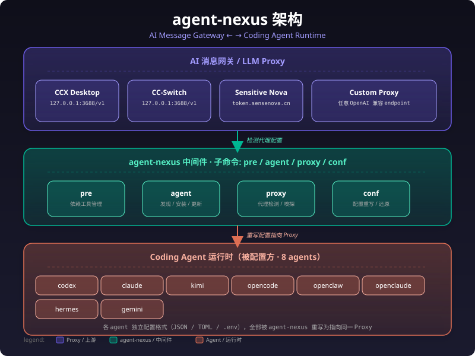

# agent-nexus — AI Agent 配置自动化工具

## 一句话

agent-nexus 是 coding agent 配置领域的 `/etc/hosts`：一条命令，把散落在本机各处的 LLM endpoint 和 API Key 统一重定向到一个 AI 消息网关。

agent-nexus 支持 11 个可安装的 agent 运行时，覆盖 CLI 和 IDE 两大类。`agent list` 是权威列表。

## 架构



- **AI 消息网关（proxy）**：统一上游端点，负责模型路由、计费、限流。
- **Agent 运行时**：你日常使用的 coding 工具（codex, claude, kimi, cursor 等），各有配置格式，但本质上都是"调一个 LLM endpoint"。
- **agent-nexus**：中间件 / 配置中枢。扫描本机 agent → 检测代理 → 自动备份 → 写入配置 → 建立模型路由。
- **下游协作平台**（Multica、Cursor 等）：直接复用已配置好的 agent，无需各自重复配置代理和 Key。

## 工作流

```
① 检查运行时依赖  →  agent-nexus pre check / install
② 安装 Agent 运行时 →  agent-nexus agent list / install
③ 统一配置所有 Agent  →  agent-nexus conf set --agents all
④ 验证配置        →  agent-nexus agent discover
```

完整自动化链路（详见 [MANUAL.md](MANUAL.md)）：

| 阶段 | 动作 | 命令 |
|------|------|------|
| ① 检查运行时依赖 | node/npm、python/pip、git | `agent-nexus pre check` |
| ② 安装 Agent 运行时 | codex/claude/kimi 等 11 个 agent | `agent-nexus agent install codex` |
| ③ 统一配置 | 检测代理 → 备份 → 写入配置 | `agent-nexus conf set --agents all` |
| ④ 验证 | 扫描 + 显示配置状态 | `agent-nexus agent discover` |

## 快速开始

```powershell
# 1. 检查并安装运行时依赖
agent-nexus pre check
agent-nexus pre install

# 2. 安装需要的 agent 运行时
agent-nexus agent list
agent-nexus agent install codex
agent-nexus agent install claude

# 3. 统一配置所有已安装的 agent（先备份，再写入代理配置）
agent-nexus conf set --agents all

# 4. 验证
agent-nexus agent discover
agent-nexus agent discover -v   # 显示每个 agent 的模型支持详情
```

## 命令总览

```
agent-nexus [command]

命令组：
  agent       Agent 管理（发现、安装、卸载、更新、配置、模型）
  conf        配置管理（备份、快照、回滚、分支、统一配置入口）
  proxy       AI 消息网关管理（检测、路由、嗅探、代理数据库）
  pre         检查/安装 agent 运行时依赖工具
  completion  生成 shell 自动补全脚本

全局选项：
  --url   直接指定代理 URL（覆盖自动检测）
  --key   直接指定代理 API Key（覆盖自动检测）
  --home  指定用户主目录（默认自动检测）
```

详细用法见 [MANUAL.md](MANUAL.md)。

## 支持的 Agent（11 个可安装运行时）

| Agent | 类型 | 协议 | 安装方式 | 说明 |
|-------|------|------|----------|------|
| codex | CLI | OpenAI Compatible | npm `@openai/codex` | 任意上游模型 |
| claude | CLI | OpenAI Compatible | npm `@anthropic-ai/claude-code` | 任意上游模型 |
| kimi | CLI | ACP | 官方安装脚本 | 需代理路由映射 |
| opencode | CLI | OpenAI Compatible | npm `opencode-ai` | 任意上游模型 |
| openclaw | CLI | OpenAI Compatible | 官方安装脚本 | 任意上游模型 |
| openclaude | CLI | OpenAI Compatible | npm `@gitlawb/openclaude` | .env 格式配置 |
| cursor | IDE | OpenAI Compatible | 官方下载页 | VS Code 派生 IDE |
| hermes | CLI | ACP | 官方安装脚本 | 需代理路由映射 |
| kiro | CLI | ACP | 无内置安装器 | 需代理路由映射 |
| grok | CLI | ACP | 官方安装脚本 | 需代理路由映射 |
| gemini | CLI | 无 | npm `@google/gemini-cli` | Google auth（OAuth/API key） |

## 安装 Agent 运行时

agent-nexus 自带安装器，支持 npm、pip、官方下载页、GitHub release 等多种方式，根据平台（Windows/macOS/Linux）自动选择：

```powershell
# 查看可安装的 agent
agent-nexus agent list

# 安装单个 agent
agent-nexus agent install codex

# 安装全部 CLI agent
agent-nexus agent install --all

# 卸载 / 更新
agent-nexus agent uninstall codex
agent-nexus agent update codex
```

安装后运行 `agent-nexus agent discover` 确认已安装 agent 列表和配置状态。

## 统一配置入口：`conf set`

`agent-nexus conf set` 是推荐的统一配置入口，整合了备份和配置写入：

```powershell
# 配置所有已安装 agent（推荐）
agent-nexus conf set --agents all

# 只配置部分 agent
agent-nexus conf set --agents codex,claude

# 从代理数据库选择代理
agent-nexus conf set --agents all --db-id 1

# 交互式确认模型映射
agent-nexus conf set --agents all --interactive

# 预览模式（不实际写入）
agent-nexus conf set --agents all --dry-run

# 覆盖模型映射
agent-nexus conf set --agents all --models "codex=gpt-5.5"
```

代理来源优先级（从高到低）：

1. `--url` + `--key` — 直接使用，跳过检测和 DB
2. `--db-id <n>` — 从 `proxies.db` 按 ID 查找
3. `--db` — 从 `proxies.db` 交互/非交互选择
4. 自动检测 — `proxy.Detect()`（CCX Desktop / CC-Switch）

> 旧命令 `agent configure` 和 `conf auto` 仍可用，但已弃用，建议迁移到 `conf set`。

## 代理支持

- **CCX Desktop**（自动检测）：读取 `~\AppData\Roaming\ccx-desktop\.config\config.json` 和 `.env`，默认监听 `127.0.0.1:3688`
- **CC-Switch**（自动检测）：读取 `~\AppData\Roaming\cc-switch\.config\config.json` 和 `.env`
- **自定义代理**（手动）：通过 `--url` + `--key` 指定任意代理地址
- **代理数据库**：通过 `proxy db add` 嗅探并保存代理配置，供 `conf set --db-id` 复用

## 配置版本化管理

类 Git 的配置快照系统，支持快照、分支、差异对比和回滚：

```
agent-nexus conf backup           # 创建只读快照（推荐替代 conf bak）
agent-nexus conf backup --dry-run # 预览将被备份的文件
agent-nexus conf history          # 列出所有快照
agent-nexus conf diff --old 1 --new 2  # 对比两个快照
agent-nexus conf rollback -s latest    # 回滚到最新快照
agent-nexus conf branch list            # 列出分支
```

快照存储结构：

```
~/.codex/backups/
├── versioning.json                 # 元数据注册表（快照索引 + 分支信息）
└── snapshots/
    ├── 2026-07-17_14-30-00/        # 快照 1（原始备份文件）
    └── ...
```

> 旧命令 `conf bak`、`conf show` 仍可用，但已弃用，请迁移到 `conf backup`。

## 查看模型信息

```powershell
# 显示所有 agent 原生支持的模型
agent-nexus agent models

# 查询特定 agent
agent-nexus agent models --name codex
```

## 查询上游模型列表

配置前确认代理当前实际接入的模型：

```powershell
agent-nexus conf upstream-models
agent-nexus conf upstream-models --url http://127.0.0.1:3688/v1 --key sk-xxx
```

## 项目结构

```
agent-nexus/
├── main.go                          # 入口
├── go.mod / go.sum                  # Go 模块定义
├── cmd/
│   ├── root.go                      # Cobra CLI 命令定义
│   ├── runconfauto.go               # conf auto（旧，兼容）
│   ├── runconfbackup.go             # conf backup
│   └── runconfset.go                # conf set（统一配置入口）
└── internal/
    ├── agent/                       # 各 agent 配置写入器（可插拔）
    ├── backup/                      # 备份逻辑
    ├── color/                       # 终端彩色输出
    ├── db/                          # SQLite 代理配置数据库
    ├── discover/                    # 自动发现 agent
    ├── install/                     # agent 运行时安装
    ├── model/                       # 模型路由表构建
    ├── pre/                         # 运行时依赖检查与安装
    ├── proxy/                       # 代理检测（CCX / CC-Switch / 自定义）
    ├── sniff/                       # LLM endpoint 嗅探
    └── versioning/                  # 配置版本化（快照/分支/差异）
```

## 扩展新 Agent

实现 `agent.ConfigWriter` 接口并注册到 `WriterRegistry` 即可，详见 [MANUAL.md](MANUAL.md#扩展新-agent)。

## License

MIT
